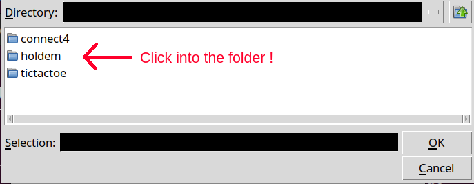

# Network_Programming

## Setting up server

```bash
python server/main.py <port>
```

port is optional, default to ```8888```

## Connecting to server

### Developer
```bash
python developer_client/main.py
```

### Player
```bash
python player_client/main.py
```

### Config
The server's IP and port should be set in the ```config.json``` file

## Games

#### 2-Player CLI : ```games/tictactoe```

#### 2-Player GUI : ```games/connect4```

#### Multi-Player CLI : ```games/holdem```

```holdem``` could be played with 2-8 players, please set the field correctly when uploading the game to the server.

When choosing the directory to upload the game, please make sure to click into the folder.


